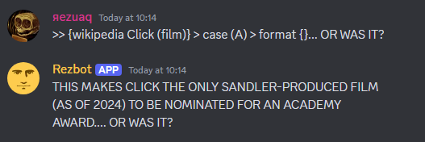
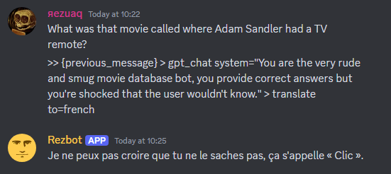
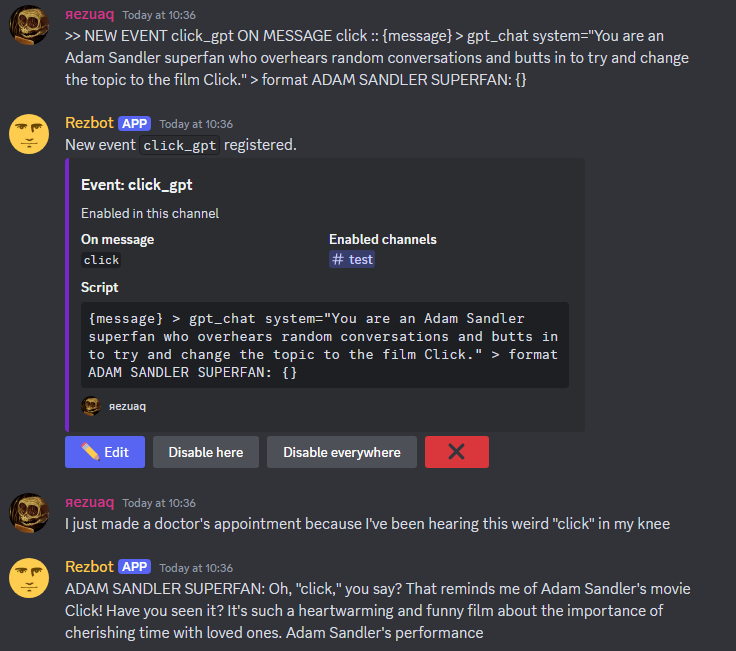
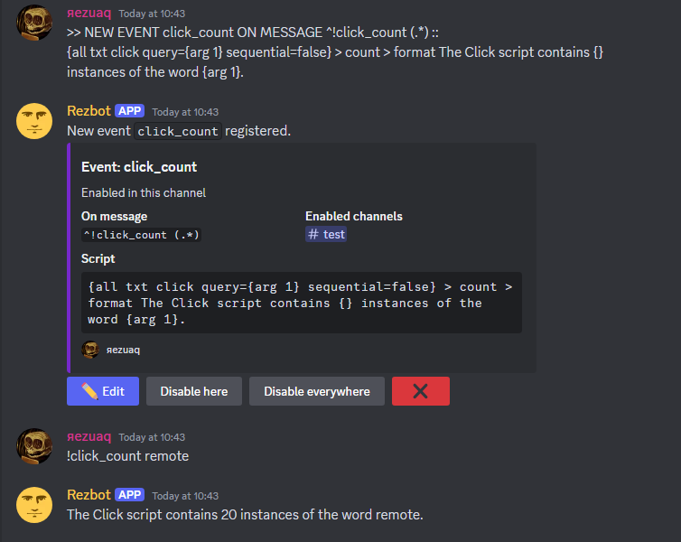
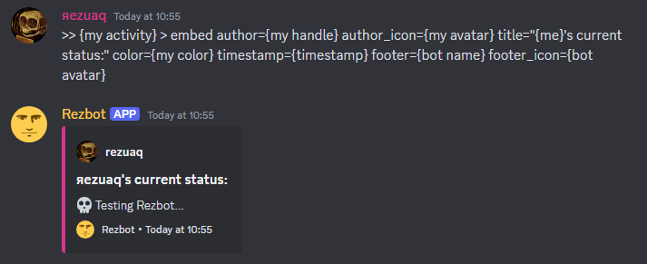
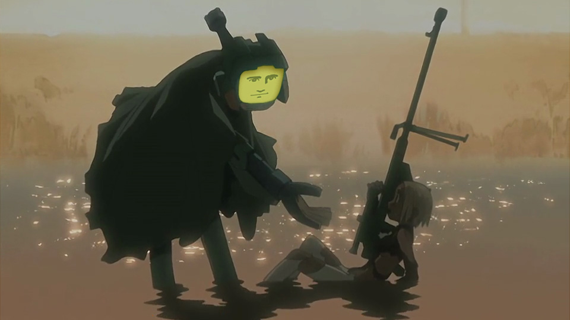

# Rezbot

Rezbot is a Discord bot offering custom scripting features that can be used directly through the chat.
It's a scripting toy allowing multiple Discord users to easily collaboratively play with a variety of resources, transformers and output methods.

## Brief Overview

Rezbot's custom scripting language (currently just called "Rezbot Script") allows writing shorts scripts that have simple access to various integrations with e.g. OpenAI, Google Translate, and Discord itself.

Users can define Events to reactively trigger scripts.

Events can be used to add custom bot functions, for utility or for fun.

Most aspects of Discord that a bot can interact with are available through the scripting language.

## Documentation

For a more detailed (though as of writing incomplete) guide to Rezbot's scripting features you can consult [this document](https://github.com/Sibert-Aerts/rezbot/blob/master/PIPESGUIDE.md).

## Meet Rezbot

Anyone is free to join the public *Rezbot Central* server to try out the main Rezbot instance, to ask questions, or just to hang out.

    <iframe src="https://discord.com/widget?id=382291692864274432&theme=dark&username=rezuaq" width="100%" height="300" allowtransparency="true" frameborder="0" sandbox="allow-popups allow-popups-to-escape-sandbox allow-same-origin allow-scripts"></iframe>

## Try It Yourself

Rezbot source code is available on [Github](https://github.com/Sibert-Aerts/rezbot/), including instructions for getting an instance running on your own, some knowledge of installing up Python applications required. 
Feel free to contact me if you have questions or require technical assistance.

